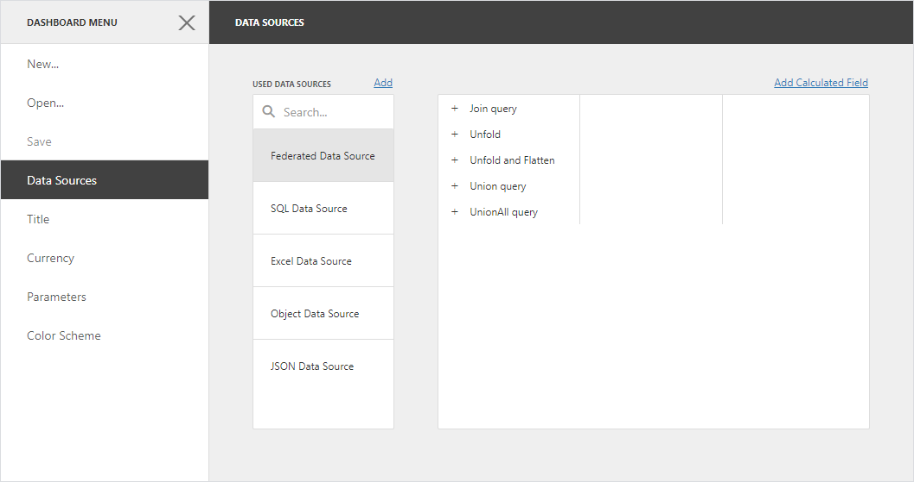

<!-- default badges list -->

<!-- default badges end -->
*Files to look at*:

* [Default.aspx.cs](./CS/AspNetWebFormsDataFederation/Default.aspx.cs) (VB: [Default.aspx.vb](./VB/AspNetWebFormsDataFederation/Default.aspx.vb))

# ASP.NET Web Forms Dashboard - How to Register a Federated Data Source

This example registers the [DashboardFederationDataSource](https://docs.devexpress.com/Dashboard/DevExpress.DashboardCommon.DashboardFederationDataSource) from the following set of [data sources](https://docs.devexpress.com/Dashboard/116522):

* [DashboardSqlDataSource](https://docs.devexpress.com/Dashboard/401437) (the SQLite database)
* [DashboardExcelDataSource](https://docs.devexpress.com/Dashboard/401433)
* [DashboardObjectDataSource](https://docs.devexpress.com/Dashboard/401435)
* [DashboardJsonDataSource](https://docs.devexpress.com/Dashboard/401431)

The federated data source is stored in the in-memory storage ([DataSourceInMemoryStorage](https://docs.devexpress.com/Dashboard/DevExpress.DashboardWeb.DataSourceInMemoryStorage)) and is available from the [Add Data Source](https://docs.devexpress.com/Dashboard/117456/web-dashboard/create-dashboards-on-the-web/providing-data/manage-data-sources) dialog. Note that when you add a federated data source to a dashboard, all data sources used in the federated data source are also added to the dashboard.

This example demonstrates the following query types you can use to create a data federation:

* **Join**
    
    Combines rows from two or more tables based on a clause. The join type specifies records that have matching values in both tables.

* **Union and UnionAll**

    The **Union** query combines rows from two or more tables into one data set and removes duplicate rows in merged tables. The **UnionAll** query does the same, except it doesn't remove duplicated rows. You can create a union query for data sources if data types of their columns are [implicitly converted](https://docs.microsoft.com/en-us/dotnet/csharp/programming-guide/types/casting-and-type-conversions#implicit-conversions).        
    
* **Transformation**

    If a data source contains a complex column (an object), you can transform its properties to display them as separate columns in a flattened view. If one of the data columns is an array, you can unfold its values and display a new data row for every element of the array. When you unfold the column, you can flatten it and create a flattened view

## Documentation

* [ASP.NET Web Forms Framework - Register a Federated Data Source](https://docs.devexpress.com/Dashboard/402458)
* [Register Default Data Sources](https://docs.devexpress.com/Dashboard/116300)

## Examples

- [ASP.NET Core Dashboard - How to Register a Federated Data Source](https://github.com/DevExpress-Examples/aspnet-core-dashboard-data-federation)
- [ASP.NET MVC Dashboard - How to Register a Federated Data Source](https://github.com/DevExpress-Examples/aspnet-mvc-dashboard-data-federation)
